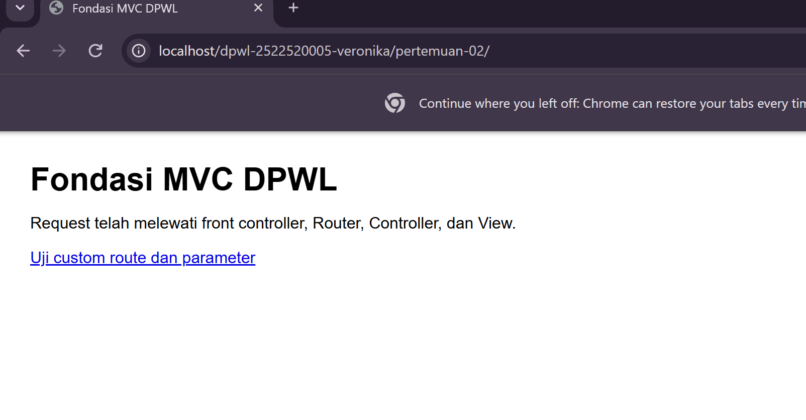
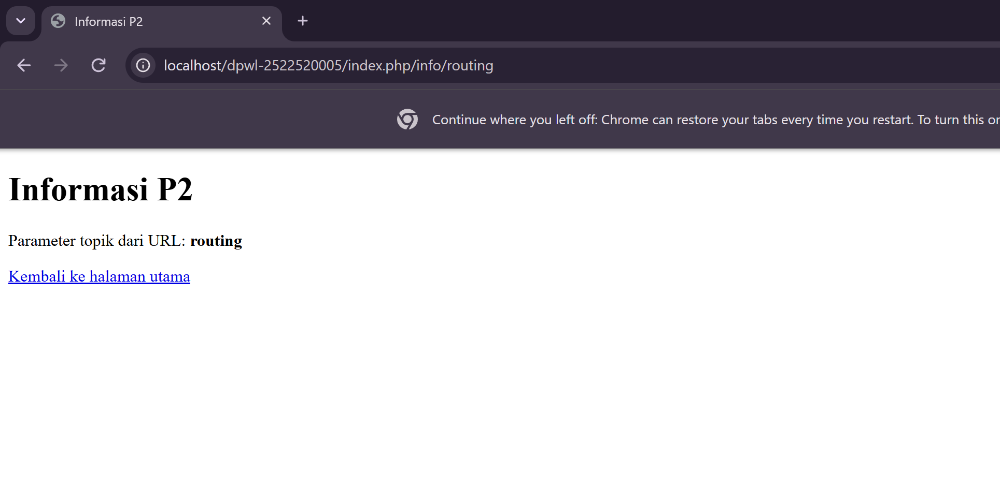
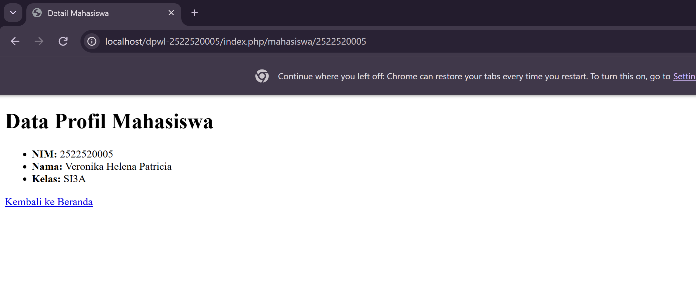

# pertemuan-02
## 1. Tujuan Praktikum
[Tujuan pratikum P2 ini untuk memahami konsep MVC pada aplikasi DPW, seperti Controller, View, Routing,Front.]
## 2. Struktur Direktori
[Tampilkan tree struktur P2 dan jelaskan fungsi setiap bagian.]
## jawaban 2. Struktur Direktori
```text
pertemuan-02/
├── application/
│   ├── config/
│   │   ├── config.php      -> Mengatur konfigurasi dasar aplikasi (Base URL, dll)
│   │   └── routes.php      -> Mengatur pemetaan rute URL ke Controller
│   ├── controllers/
│   │   └── Home.php        -> Controller utama untuk menangani logika request
│   ├── helpers/
│   │   └── url_helper.php  -> Menyediakan fungsi bantuan base_url() dan site_url()
│   └── views/
│       └── home/
│           ├── index.php   -> View untuk halaman utama (beranda)
│           ├── info.php    -> View untuk menampilkan informasi routing
│           └── mahasiswa.php -> View kustom untuk profil mahasiswa
├── assets/
│   └── css/
│       └── app.css         -> File stylesheet aset statis
├── system/                  -> Core framework MVC
└── index.php               -> Front Controller (pintu masuk utama aplikasi)
```
## 3. Front controller
[Peran index.php sebagai satu titik masuk aplikasi adalah setelah request diterima, aplikasi membaca URL, dilanjutkan dengan menentukan route, kemudiaa memanggil controller dan menthod yang sesuai. Controller selanjutnya memproses request dan menampilkan view sebaga response.]
## 4. Routing dan Pemetaan URL
## 4. Routing dan Pemetaan URL
| URL/Route | Controller | Method | Parameter | View |
|---|---|---|---|---|
| / | Home | index | - | home/index.php |
| home/index | Home | index | - | home/index.php |
| home/info/mvc | Home | info | mvc | home/info.php |
| info/routing | Home | info | routing | home/info.php |
| mahasiswa/(:num) | Home | mahasiswa | $1 | home/mahasiswa.php |

**Penjelasan Pemetaan Rute Modifikasi ATM:**
- **Route (`mahasiswa/(:num)`):** Menangkap permintaan URL yang diawali kata `mahasiswa/` dan diikuti oleh angka variabel `(:num)` (misalnya NIM `2522500012`).
- **Controller (`Home`):** Menunjuk ke kelas `Home` pada berkas `application/controllers/Home.php`.
- **Method (`mahasiswa`):** Mengeksekusi fungsi/method `mahasiswa()` di dalam Controller `Home`.
- **Parameter (`$1`):** Nilai angka NIM dari URL ditangkap oleh wildcard `(:num)` dan dikirim sebagai argumen ke method `mahasiswa($nim)`.
- **View (`home/mahasiswa.php`):** Controller mengolah data profil (NIM: 2522500012, Nama: Fariq Akbar Al Fawakih, Kelas: SI3A) lalu memuat tampilan akhir pada file View `home/mahasiswa.php`.
## 5. Base URL dan Helper
-base_url() digunakan untuk menghasilkan URL dasar aplikasi, terutama saat memanggil file CSS,JavaScript,dan gambar. 
-site_url(), digunakan untuk membentuk URL yang mengarah ke route atau halaman aplikasi
 -CONTOH base_url() <link rel="stylesheet" href="<?= base_url('assets/css/app.css') ?>">
 -CONTOH site_url() <a href="<?= site_url('home/index') ?>">Home</a>
- base_url() untuk memanggil assets/css/app.css; 
- site_url() untuk membentuk URL navigasi/route aplikasi.
## 6. Alur Request-response
Jelaskan dua alur berikut:
1. Alur eksekusi aktual P2:
Browser: pengguna mengakses URL aplikasi.
 -index.php: menjadi front controller yang menerima request.
 -Router: menentukan route dan controller yang harus dijalankan.
 -Controller: memproses request dan menentukan view yang akan ditampilkan.
 -View: menghasilkan tampilan halaman.
 -Response: hasil dari proses dikirim kembali ke browser. 
2. Posisi Model dalam arsitektur MVC lengkap:
Pada MVC lengkap, setelah request diterima oleh Controller, Controller dapat meminta Model untuk mengambil atau mengolah data dari database. Data tersebut dikembalikan ke Controller, kemudian Controller meneruskannya ke View. View menampilkan data kepada pengguna sebagai response.

P2: Browser → index.php → Router → Controller → View → Response
P3/MVC lengkap: Browser → index.php → Router → Controller → Model → Database → Controller → View → Response
diimplementasikan pada P3.
## 7. Hasil Pengujian dan Debugging
-Pengujian Tidak Valid
URL yang tidak memiliki route atau controller yang sesuai akan menghasilkan halaman error atau pesan bahwa halaman tidak ditemukan.

-Pemeriksaan Sintaks dan Debugging
Selama implementasi dilakukan pemeriksaan terhadap struktur kode, routing, dan pemanggilan controller. Jika terjadi error, proses debugging dilakukan dengan urutan:
## 8. Bukti Tangkapan Layar
Sisipkan gambar yang relevan dari folder dokumentasi/ dengan perintah:
### Gambar 1. Hasil Pengujian Halaman Utama 
 
### Gambar 2. Hasil Pengujian Custom Route 

### Gambar 3. Profil Mahasiswa

## 9. Kesimpulan P2
-P2 telah dipahami dan diterapkan kerangka dasar MVC, terutama penggunaan front controller, routing, controller, method, parameter, dan view. Aplikasi sudah dapat menerima request dan menghasilkan response sesuai route yang ditentukan.

-P3, bagian yang akan dikembangkan adalah Model dan pengelolaan database, sehingga aplikasi tidak hanya mengatur tampilan dan routing tetapi juga dapat mengakses serta mengolah data.